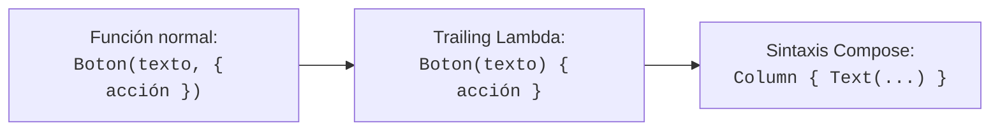

# 2. Funciones, Parámetros y Lambdas

> Comprender las funciones y lambdas en Kotlin es la clave para dominar Jetpack Compose, ya que toda la interfaz se construye con funciones.

---

## ⚙️ Declaración de Funciones: `fun`

En Kotlin, las funciones se declaran con la palabra reservada `fun`.

```kotlin
// Función con parámetros y valor de retorno
fun sumar(a: Int, b: Int): Int {
    return a + b
}

// Función sin valor de retorno (devuelve Unit, equivalente a void en otros lenguajes)
fun saludar(nombre: String): Unit {
    println("¡Hola, $nombre!")
}

// El tipo Unit se puede omitir:
fun saludarSimple(nombre: String) {
    println("¡Hola, $nombre!")
}
```

---

## 🎯 Parámetros con Nombre y Valores por Defecto

Kotlin permite dos características que hacen que el código sea extremadamente legible y flexible:

### 1. Valores por Defecto (Default Arguments)
Puedes asignar un valor inicial a cualquier parámetro. Si quien llama a la función no pasa ese argumento, se usará el valor por defecto.

```kotlin
fun crearMensaje(texto: String, autor: String = "Anónimo", urgente: Boolean = false) {
    println("[$autor] $texto (Urgente: $urgente)")
}

// Diferentes formas de llamarla:
crearMensaje("Hola")                         // [Anónimo] Hola (Urgente: false)
crearMensaje("Reunión", "Profesor", true)   // [Profesor] Reunión (Urgente: true)
```

### 2. Parámetros con Nombre (Named Arguments)
Puedes especificar el nombre del parámetro al llamar la función, sin importar el orden:

```kotlin
crearMensaje(
    urgente = true,
    texto = "Subir tarea antes de las 11:59 PM",
    autor = "Delegado"
)
```

> [!TIP]
> **¿Por qué esto es vital en Compose?**  
> Componentes como `Text`, `Button` o `TextField` tienen decenas de parámetros opcionales (`fontSize`, `color`, `maxLines`, `modifier`, etc.). Gracias a los parámetros con nombre y valores por defecto, solo necesitas especificar los que realmente quieres cambiar.

---

## ⚡ Funciones de una sola línea (Single-Expression Functions)

Cuando una función solo contiene una única expresión o cálculo, puedes prescindir de las llaves `{}` y del `return` usando el signo `=`:

```kotlin
// Forma tradicional:
fun esMayorDeEdad(edad: Int): Boolean {
    return edad >= 18
}

// Forma compacta (Single-expression):
fun esMayorDeEdadCompacta(edad: Int): Boolean = edad >= 18

// Con inferencia de tipo de retorno:
fun cuadrado(numero: Int) = numero * numero
```

---

## 🪢 Lambdas (Funciones Anónimas)

Una **lambda** es un bloque de código entre llaves `{}` que puedes guardar en una variable, pasar como argumento a otra función o ejecutar cuando ocurra un evento (por ejemplo, al hacer clic en un botón).

```kotlin
// Una lambda básica que recibe dos números y devuelve su suma:
val sumarLambda: (Int, Int) -> Int = { x, y -> x + y }

// Ejecutar la lambda:
val resultado = sumarLambda(3, 4) // resultado es 7
```

### El parámetro implícito `it`
Si una lambda recibe **un solo parámetro**, no necesitas nombrarlo: Kotlin te da la variable implícita `it`:

```kotlin
val duplicar: (Int) -> Int = { it * 2 }

println(duplicar(10)) // Imprime 20
```

---

## 🪄 La Magia de Jetpack Compose: Trailing Lambda Syntax

En Kotlin existe una regla sintáctica muy especial:  
> **Si el ÚLTIMO parámetro de una función es una lambda, puedes escribirla FUERA de los paréntesis `()`.** Y si la lambda es el único argumento, los paréntesis `()` se pueden eliminar por completo.

### Paso a paso: ¿Cómo nace la sintaxis de Compose?

Imagina una función para un botón:

```kotlin
fun MiBoton(texto: String, onClick: () -> Unit) {
    // Lógica del botón...
}
```

1. **Llamada normal (con la lambda adentro):**
   ```kotlin
   MiBoton("Guardar", { println("Clickeado") })
   ```

2. **Aplicando Trailing Lambda (sacando la lambda fuera de los paréntesis):**
   ```kotlin
   MiBoton("Guardar") {
       println("Clickeado")
   }
   ```

### ¿Por qué `Column`, `Row` y `Box` se escriben así?

`Column` es simplemente una función Kotlin cuyo último parámetro es una lambda de contenido (`content: @Composable () -> Unit`):

```kotlin
// Como el único parámetro que nos interesa es el contenido, se omiten los ()
Column {
    Text(text = "Primer elemento")
    Text(text = "Segundo elemento")
}

// O con modificador:
Column(modifier = Modifier.fillMaxSize()) {
    Text(text = "Hola")
}
```



---

## 🎨 Conexión con Jetpack Compose

Veamos cómo se combinan funciones normales, lambdas y `@Composable`:

```kotlin
@Composable
fun BotonPersonalizado(
    texto: String,
    habilitado: Boolean = true,      // Parámetro con valor por defecto
    alPresionar: () -> Unit          // Lambda que se ejecuta al presionar
) {
    Button(
        onClick = alPresionar,       // Pasamos la lambda
        enabled = habilitado
    ) {
        Text(text = texto)
    }
}
```

---

_Siguiente: [Null Safety y Control de Flujo →](3-null-safety.md)_
