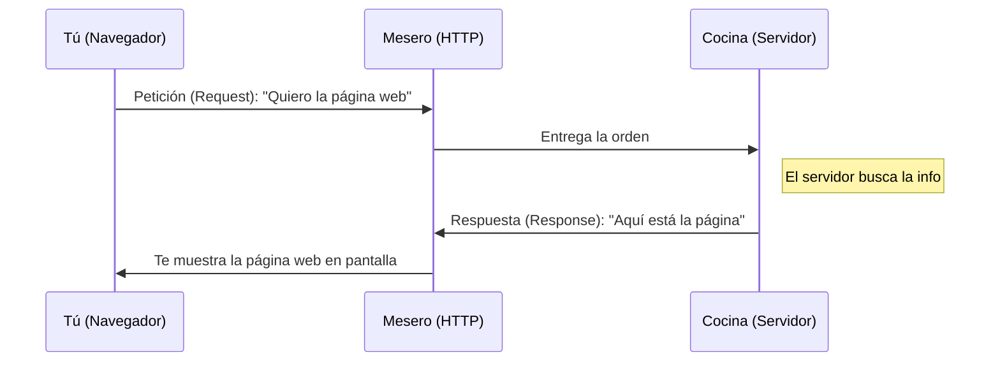

# ¿Qué es HTTP?

¡Imagina que estás en un restaurante! 🍔

* **Tú (El Cliente):** Eres como el navegador web de tu computadora o la aplicación en tu celular (ej. Chrome, Safari, Instagram).
* **El Cocinero (El Servidor):** Es la computadora que tiene la información o la página web que quieres ver. Es como la cocina que prepara tu comida.
* **El Mesero (HTTP):** Es el protocolo HTTP. Es el encargado de llevar tu pedido desde tu mesa hasta la cocina, y luego traer tu plato de vuelta.

**HTTP** significa **H**yper**T**ext **T**ransfer **P**rotocol (Protocolo de Transferencia de Hipertexto). En palabras simples, son **las reglas de comunicación** que usa el internet para que tu computadora hable con otras computadoras.

---

### ¿Cómo funciona la comunicación?

Todo en HTTP se resume a dos acciones muy sencillas: **Petición (Request)** y **Respuesta (Response)**.

1. **Petición (Request):** Le pides al mesero "Quiero una hamburguesa". En internet, tu computadora le dice al servidor "Quiero ver la página de inicio de Facebook".
2. **Respuesta (Response):** El mesero te trae tu hamburguesa. En internet, el servidor te envía las imágenes, textos y diseño de la página de inicio.

### Diagrama del Restaurante (HTTP)

---

### Los Códigos de Estado (Las respuestas del mesero)

A veces las cosas no salen como esperamos. El "mesero" (HTTP) tiene formas de decirte cómo fue todo mediante números llamados **Códigos de Estado**:

* **200 (Todo OK):** "¡Aquí está tu pedido!". (Tu página cargó perfectamente). 👍
* **404 (No Encontrado):** "Lo siento, ya no nos queda ese plato". (La página que buscas no existe o fue borrada). 🤷‍♂️
* **500 (Error del Servidor):** "La cocina se incendió". (El servidor de la página web tiene problemas internos). 🔥
