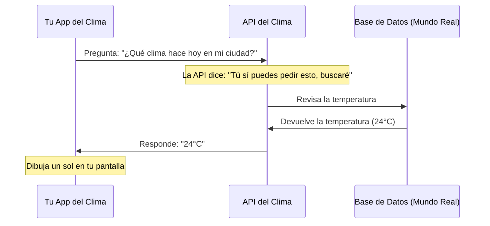

# ¿Qué es una API?

Imagina que sigues en el restaurante. Ya sabes que **HTTP** es el mesero, pero ¿cómo sabes **qué** puedes pedir? 🤔

Ahí es donde entra **el Menú**.

Una **API** (Application Programming Interface, o Interfaz de Programación de Aplicaciones) **es el mecanismo o puente de comunicación que permite a dos aplicaciones o programas diferentes hablar entre ellos** de forma segura. 

En palabras sencillas: **las APIs son como un menú de restaurante para las computadoras.**

Así como el menú te dice: *"Puedes pedir papas fritas y cuestan esto"*. 
La API le dice a tu computadora (o a otras aplicaciones): *"Puedes pedirme la lista de usuarios y necesitas darme tu contraseña"*.

### Un ejemplo del mundo real 🌍

Imagina que estás usando una aplicación del clima en tu celular. 

¿Esa aplicación tiene sus propios satélites en el espacio para saber si va a llover? ¡Claro que no! La aplicación usa **la API** de un instituto meteorológico.

1. Tu app del clima dice: *"Hola API del Instituto, usando HTTP (mi mesero), ¿me puedes dar el clima de Lima para hoy?"*
2. La API revisa el "menú" y responde: *"Claro, tú me preguntaste correctamente. Toma, aquí tienes: 24 grados y soleado"*.
3. Tu app del clima te muestra un dibujito de un sol brillante. ☀️

---

### ¿De qué sirven las APIs?

1. **Compartir información sin revelar secretos:** El restaurante (Servidor) no te deja entrar a su cocina a cocinar. Solo te da un menú (API) con lo que puedes pedir. Así protegen sus recetas (Datos).
2. **Conectar aplicaciones diferentes:** Gracias a las APIs, aplicaciones como Uber pueden poner mapas de Google Maps dentro de su app, sin tener que inventar su propio mapa.

### Diagrama del Clima (API)

