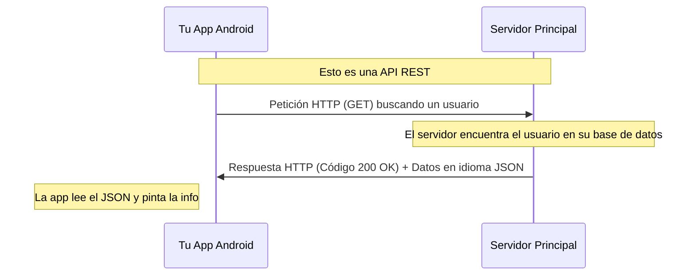

# ¿Qué son REST y JSON?

Ahora que sabemos que las APIs son como "menús" que las computadoras usan para hablar, y HTTP es el "mesero"... ¡Seguro te preguntas en qué **idioma** ocurre toda esta charla!

Ahí entra **JSON**. Y sobre las **reglas** que debe tener el diseño de ese restaurante (por así llamarlo), entra **REST**.

---

### ¿Qué es JSON? 📝

Imagina que tu aplicación está en Japón (habla japonés) y la del clima está en México (habla español). ¿Cómo se entienden? ¡Necesitan un idioma en común!

**JSON** (JavaScript Object Notation) es **el idioma universal de las computadoras modernas**. Es simplemente un formato de texto muy fácil de leer, tanto para los humanos como para las máquinas.

En vez de responder *"Hoy hace veinticuatro grados y está soleado"*, la API responde con un "paquetito" escrito de manera ordenada usando corchetes y comillas. 

**Ejemplo de una respuesta JSON fácil de leer:**
```json
{
  "ciudad": "Lima",
  "temperatura": 24,
  "clima": "soleado"
}
```
*¡Es súper ordenado!* Tu aplicación Android (usando Kotlin y Jetpack Compose) puede leer ese `JSON` facilísimo y poner la palabra "soleado" en tu pantalla.

---

### ¿Qué es REST? 🏛️

**REST** (o RESTful) no es una tecnología ni un programa, **es un estilo o arquitectura para construir APIs**. Son como las "reglas de buena educación" en ese restaurante. 

Si una API es un restaurante "estilo REST", significa que sigue reglas súper organizadas para que todos operen igual. 

Las reglas básicas de REST utilizan los "Verbos HTTP" (las intenciones del cliente) de esta forma:
* **GET:** *"Quiero información"*. (Ej: leer mi perfil de usuario).
* **POST:** *"Quiero crear algo nuevo"*. (Ej: publicar un tweet nuevo).
* **PUT:** *"Quiero actualizar todo esto"*. (Ej: cambiar mi foto de perfil).
* **DELETE:** *"Quiero borrar esto"*. (Ej: eliminar un mensaje).

### Resumen Visual: Todo Funcionando Juntos 🚀


