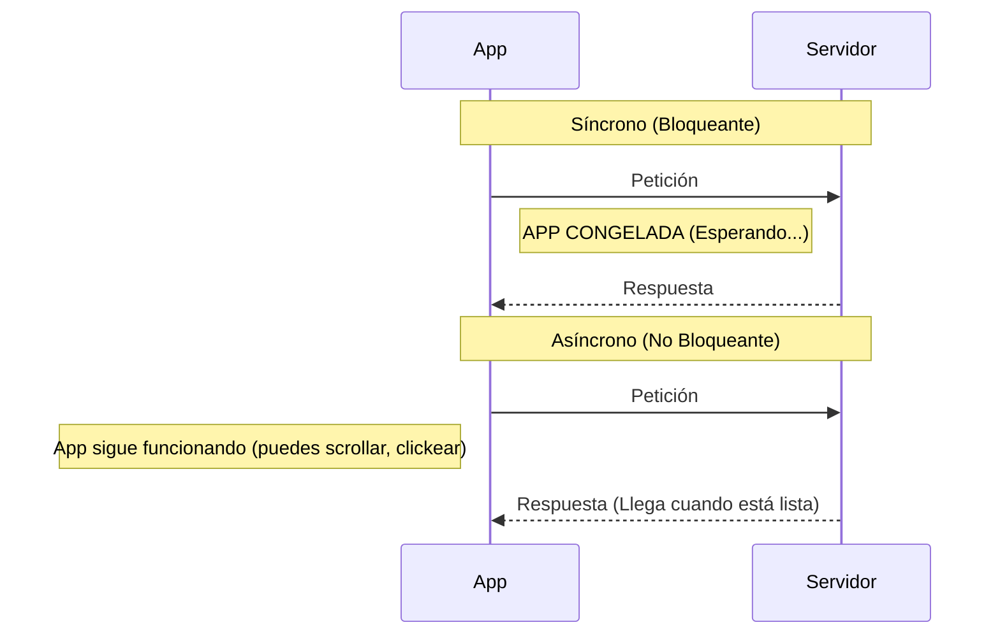

# Síncrono vs Asíncrono ⏳

¡Imagina que estás en una cafetería! ☕️

En el mundo de la programación, especialmente cuando trabajamos con internet (HTTP), es vital entender cómo se ejecutan las tareas. Existen dos formas principales: **Síncrona** y **Asíncrona**.

---

### 1. Comunicación Síncrona (En fila) 🚶‍♂️🚶‍♀️

Imagina que estás en una fila para pedir café.
1. Haces tu pedido.
2. **Te quedas parado frente a la caja** esperando a que te den tu café.
3. No puedes hacer nada más (ni mirar tu celular, ni hablar con nadie) hasta que tengas el café en la mano.
4. Una vez que lo recibes, recién puedes retirarte y seguir con tu vida.

**En programación:** Una tarea síncrona bloquea la ejecución del resto del código hasta que termina. Si pides datos a internet de forma síncrona, tu aplicación se "congela" hasta que llegue la respuesta.

---

### 2. Comunicación Asíncrona (Con localizador) 📟

Ahora imagina una cafetería moderna:
1. Haces tu pedido.
2. El cajero te entrega un **localizador (pagger)** que vibrará cuando el café esté listo.
3. Mientras esperas, puedes sentarte, leer un libro o charlar con amigos. **No estás bloqueado.**
4. Cuando el localizador vibra, vas a recoger tu café.

**En programación:** Una tarea asíncrona inicia el proceso y permite que el resto del código siga funcionando. Cuando la tarea termina (ej. llega la respuesta de internet), se ejecuta un aviso o función para manejar ese resultado.

---

### Comparación Visual

---

### ¿Por qué es importante en Android? 📱

En Android existe algo llamado el **Main Thread (Hilo Principal)** o **UI Thread**. Es el encargado de dibujar todo lo que ves en pantalla y responder a tus toques.

* **❌ Si haces una petición Síncrona:** Bloqueas el Main Thread. El usuario sentirá que la app se trabó, no podrá hacer scroll ni presionar botones. Si tarda mucho, Android mostrará el error "Application Not Responding" (ANR).
* **✅ Si haces una petición Asíncrona:** La petición ocurre en "segundo plano" (background). El usuario puede seguir usando la app normalmente mientras los datos se descargan.

### Resumen rápido:
| Característica | Síncrono (Sync) | Asíncrono (Async) |
| :--- | :--- | :--- |
| **Espera** | Bloquea hasta terminar | No bloquea, sigue trabajando |
| **Experiencia** | La app se congela | La app es fluida |
| **Uso ideal** | Tareas instantáneas (sumas, textos) | Tareas largas (Internet, Base de datos) |
