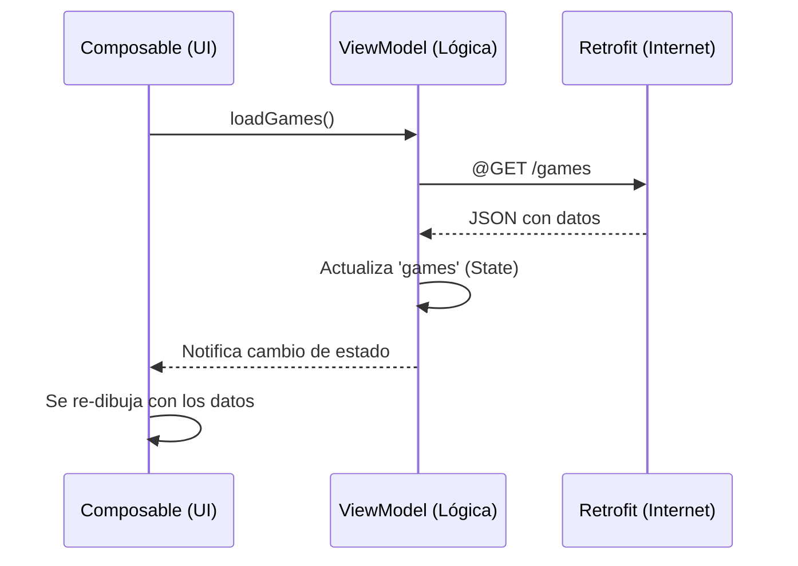

# ViewModel: El cerebro de nuestra pantalla 🧠

Imagina que vas a una cafetería. El **mesero** (nuestra Screen o UI) es quien te atiende, te muestra el menú y te trae el café. Pero el mesero no sabe preparar el café, ni sabe cuántos granos quedan en el almacén.

Para eso está el **Gerente de Barra** (el **ViewModel**). El mesero le pide las cosas al gerente, y el gerente se encarga de hablar con la cocina (Internet/Base de Datos) y mantener todo bajo control. Si el mesero se tropieza y tiene que irse a cambiar de uniforme (cuando giras el celular y la Activity se destruye), el gerente sigue ahí con el pedido listo para el siguiente mesero.

---

### ¿Qué es un ViewModel?
Es una clase diseñada para **almacenar y gestionar datos relacionados con la interfaz de usuario**. Su objetivo principal es separar la lógica de negocio (como pedir datos a internet) de la parte visual (como dibujar un botón).

#### 1. Sobrevive a cambios de configuración
Si rotas la pantalla de tu celular, Android destruye y recrea tu pantalla. Si los datos estaban guardados en una variable común del Composable, **se pierden**. El ViewModel vive en un lugar especial de la memoria que no se destruye al rotar la pantalla.

#### 2. Separación de Responsabilidades
- **Composable (UI):** Solo se encarga de "dibujar". No debería saber nada de URLs ni Retrofit.
- **ViewModel (Lógica):** Se encarga de llamar a la API y guardar el resultado.

---

### Diferencias: Llamada Directa vs ViewModel

| Característica | Llamada Directa (En el Componente) | Usando ViewModel |
| :--- | :--- | :--- |
| **Organización** | El código se vuelve largo y difícil de leer. | Código limpio y separado. |
| **Rotación de pantalla** | Los datos se pierden o la petición se repite. | Los datos se mantienen intactos. |
| **Pruebas (Testing)** | Muy difícil de probar. | Fácil de probar sin necesidad de una UI. |
| **Reutilización** | Solo sirve para esa pantalla. | La lógica se puede compartir. |

---

### Sintaxis: ¿Cómo se implementa?

#### 1. Sin ViewModel (Lo que NO debemos hacer en apps reales)
Aquí la lógica de Retrofit está mezclada con la UI.
```kotlin
@Composable
fun BadExampleScreen() {
    var games by remember { mutableStateOf(listOf<Game>()) }

    LaunchedEffect(Unit) {
        games = RetrofitClient.instance.getAllGames()
    }

    LazyColumn {
        items(games) { game -> Text(game.name) }
    }
}
```

#### 2. Con ViewModel (El estándar profesional)

Primero, creamos la clase que hereda de `ViewModel`:
```kotlin
class GameViewModel : ViewModel() {
    // 1. Estado de la lista (Privado para que nadie lo modifique fuera)
    var games by mutableStateOf(listOf<Game>())
        private set

    // 2. Función para cargar los datos
    fun loadGames() {
        viewModelScope.launch { // Usamos el scope del ViewModel
            try {
                val response = RetrofitClient.instance.getAllGames()
                games = response
            } catch (e: Exception) {
                // Manejar error
            }
        }
    }
}
```

Luego, lo usamos en nuestro Composable:
```kotlin
@Composable
fun GoodExampleScreen(
    viewModel: GameViewModel = viewModel() // 3. Obtenemos el VM
) {
    // 4. Cargamos los datos solo una vez al iniciar
    LaunchedEffect(Unit) {
        viewModel.loadGames()
    }

    // 5. Solo leemos el estado del ViewModel
    LazyColumn {
        items(viewModel.games) { game ->
            Text(game.name)
        }
    }
}
```

---

### Comparación de flujo visual



> [!TIP]
> Para usar `viewModel()` en Compose, necesitas agregar esta dependencia:
> `implementation("androidx.lifecycle:lifecycle-viewmodel-compose:2.6.1")`

---
_Siguiente: [Estados de carga →](8-estados-carga.md)_
