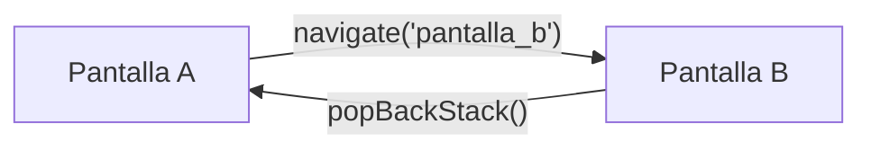

# 🏗️ NavHost y Rutas

Para implementar la navegación, necesitamos definir nuestro "Grafo de Navegación". Esto es simplemente una lista de todos los destinos a los que el usuario puede ir.

## 1. El NavController

Primero, necesitamos crear el "controlador" que manejará los saltos entre pantallas. Se crea usando `rememberNavController()`.

```kotlin
val navController = rememberNavController()
```

## 2. El NavHost

El `NavHost` es el componente que decide qué mostrar. Necesita dos cosas:
1. El `navController` que creamos antes.
2. La `startDestination` (la ruta de la pantalla inicial).

### Ejemplo de Implementación

Imagina que tenemos dos pantallas: **Pantalla A** y **Pantalla B**.

```kotlin
@Composable
fun AppNavigation() {
    val navController = rememberNavController()

    // Este es el contenedor de nuestras pantallas
    NavHost(
        navController = navController,
        startDestination = "pantalla_a" // Ruta inicial
    ) {
        // Aquí definimos cada "pueblo" en nuestro mapa
        composable("pantalla_a") {
            PantallaA(
                onNavigateToB = { navController.navigate("pantalla_b") }
            )
        }
        
        composable("pantalla_b") {
            PantallaB(
                onBack = { navController.popBackStack() }
            )
        }
    }
}
```

## 📋 Desglose del código:

*   **`composable("ruta") { ... }`**: Define un destino. El texto dentro de las comillas es el ID de esa pantalla.
*   **`navController.navigate("ruta")`**: Es la orden para "viajar" a esa pantalla.
*   **`navController.popBackStack()`**: Es la orden para volver a la pantalla anterior (como presionar el botón atrás).

## Diagrama de Flujo



> [!TIP]
> Es una buena práctica usar un `enum` o una `sealed class` para definir las rutas y evitar errores de dedo al escribir los strings, pero para aprender, los strings directos son más fáciles de entender.

---
_Siguiente: [Pasando argumentos →](3-pasar-argumentos.md)_
