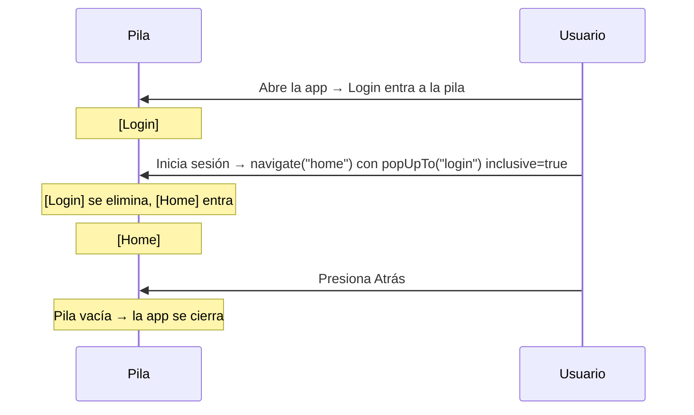

# 🗑️ Manejo de la Pila de Navegación

Cuando el usuario presiona el botón **Atrás**, la app regresa a la pantalla anterior porque la navegación funciona como una **pila** (stack): cada pantalla que visitas se apila encima de la anterior.

Pero hay casos donde ese comportamiento no es el que queremos. El ejemplo más común: **Login → Home**.

## El problema: Login en la pila

Si el usuario inicia sesión y navegamos normalmente:

```kotlin
navController.navigate("home")
```

La pila queda así:

```
[ Login ] ← [ Home ]  ← pantalla actual
```

El usuario presiona Atrás → regresa a Login. Eso no tiene sentido: si ya inició sesión, no debería poder volver al Login con el botón atrás.

## La solución: `popUpTo` con `inclusive = true`

```kotlin
navController.navigate("home") {
    popUpTo("login") { inclusive = true }
}
```

Esto le dice a Compose: *"antes de ir a Home, elimina Login (y todo lo que esté encima de él) de la pila"*.

La pila queda así:

```
[ Home ]  ← pantalla actual, sin nada debajo
```

Ahora el botón Atrás cierra la app en lugar de regresar al Login.

## ¿Qué hace `inclusive`?

| Valor | Efecto |
|---|---|
| `inclusive = true` | Elimina el destino indicado **y** todo lo que esté encima |
| `inclusive = false` (por defecto) | Elimina todo lo que esté **encima** del destino, pero lo deja a él en la pila |

## Ejemplo completo: flujo de autenticación

```kotlin
@Composable
fun AppNavigation() {
    val navController = rememberNavController()

    NavHost(navController = navController, startDestination = "login") {

        composable("login") {
            LoginScreen(
                onLoginSuccess = {
                    navController.navigate("home") {
                        // Sacamos "login" de la pila para que Atrás no regrese ahí
                        popUpTo("login") { inclusive = true }
                    }
                }
            )
        }

        composable("home") {
            HomeScreen()
        }
    }
}
```

## Diagrama



> [!TIP]
> Este patrón también aplica si tienes una pantalla de **Splash** o **Onboarding** que solo debe verse una vez. Usa `popUpTo` para sacarla de la pila al terminar.

---

_Siguiente: [Ejercicios →](5-ejercicios.md)_
