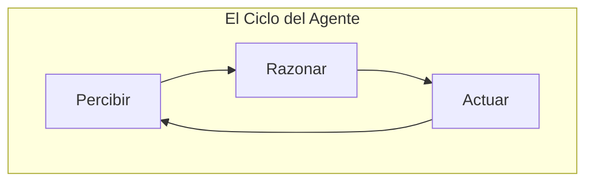

# 1. Agentes de IA

> Introducción a los programas autónomos que "razonan" y actúan.

---

## ¿Qué es un Agente de IA?

Imagina que tienes un **Chef** en una cocina profesional. 
- El **Modelo de Lenguaje (LLM)** es como el conocimiento del Chef: sabe miles de recetas, técnicas y sabores.
- El **Agente** es el Chef en acción: no solo sabe la receta, sino que decide qué sartenes usar, cuándo encender el fuego, y qué hacer si se acaba la sal.

Un **Agente de IA** no es solo un chat que responde preguntas; es un sistema que puede **planificar**, **usar herramientas** y **tomar decisiones** para completar un objetivo complejo.

---

## Ciclo de vida de un Agente

Un agente funciona en un ciclo continuo de tres pasos:

1.  **Percibir:** Recibe una instrucción o ve el estado actual de la tarea.
2.  **Razonar:** El LLM analiza qué debe hacer a continuación (¿Necesito buscar información? ¿Debo calcular algo?).
3.  **Actuar:** Ejecuta una acción (usar una herramienta, escribir código, responder al usuario).

Un agente no solo responde, sino que **decide qué hacer**. Veamos un caso concreto:

> [!EXAMPLE]
> **Caso: Agente vs Script ante un crash de Android**
> 
> - **Script tradicional:** "Si el error contiene 'NullPointerException', mostrar mensaje X. Si contiene 'OutOfMemory', mostrar mensaje Y." (Se rompe si el error es diferente)
> 
> - **Agente de IA:** "Analizo el mensaje de error, busco en la documentación, identifico la causa raíz y sugiero una solución específica según el contexto de tu app."

---

## Diferencia entre un Script y un Agente

| Característica | Script Tradicional | Agente de IA |
| :--- | :--- | :--- |
| **Lógica** | Rígida (if/else) | Flexible (Razonamiento) |
| **Imprevistos** | Se rompe o da error | Busca una alternativa |
| **Herramientas** | Solo las programadas | Elige cuál usar según la necesidad |
| **Analogía** | Una receta paso a paso | Un cocinero experto |

---

## ¿Por qué son importantes en el desarrollo?

Como desarrolladores de Android, los agentes pueden ayudarnos a:
- Generar código repetitivo (Boilerplate).
- Explicar errores complejos en el Logcat.
- Sugerir refactorizaciones basadas en buenas prácticas.

Esta capacidad de razonar y adaptarse cambia nuestra relación con la herramienta: **el agente es un asistente que amplifica lo que sabemos hacer**.

## 🧠 El Humano al Mando: Copiloto, no reemplazo

Es fácil pensar que el Agente, al tener tanto "conocimiento", puede hacerlo todo solo. Pero la realidad es distinta: **tú eres el Capitán y el Agente es tu Primer Oficial.**

### 📌 Puntos clave:
- **Decisión final:** El Agente sugiere, propone y ejecuta, pero la decisión de *qué* construir y *cómo* debe funcionar es siempre tuya.
- **Potenciador de habilidades:** La IA no reemplaza al programador, sino que multiplica su productividad. Te permite enfocarte en la arquitectura y la creatividad, mientras ella se encarga de lo repetitivo.
- **El conocimiento es poder:** Mientras más sepas sobre Kotlin, Compose y Android, mejor podrás guiar a la IA. Si no sabes qué pedir, el Agente no podrá darte un buen resultado.

> [!TIP]
> **Regla de oro:** No aceptes código de un Agente que no entiendas. Tu trabajo es revisar, corregir y dar la dirección correcta.

---

## 📋 Resumen

| Paso | Qué hace | Ejemplo en Android |
| :--- | :--- | :--- |
| **Percibir** | Recibe la tarea o detecta un cambio | "Este código me da un crash en producción" |
| **Razonar** | Analiza opciones y decide la siguiente acción | "Es un NullPointerException, busco dónde puede ser null" |
| **Actuar** | Ejecuta la acción elegida | propone la solución y escribe el código corregido |

Volviendo a la analogía del Chef: **tú eres el Chef Principal que sabe lo que quiere cocinar, el agente es tu ayudante de cocina que prepara los ingredientes y ejecuta las técnicas** — pero el plato final lo firmas tú.

---

_Siguiente: [Skills de los Agentes →](2-skills-agentes.md)_
