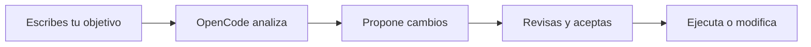

# 4. OpenCode: Tu Compañero en la Línea de Comandos

> Introducción a OpenCode, un asistente de IA basado en terminal.

---

## ¿Qué es OpenCode?

OpenCode es un **asistente de IA que vive en tu terminal**. A diferencia de chatbots en la web, OpenCode trabaja directamente con tus archivos, ejecuta comandos y te ayuda con tareas de desarrollo desde la línea de comandos.

> [!TIP]
> Piensa en OpenCode como un **programador pair** que tiene acceso directo a tu código y puede editarlos directamente, no solo sugerirte cambios.

---

## Instalación

```bash
# En macOS
brew install opencodeai/opencode/opencode

# En Linux
curl -fsSL https://get.opencode.ai | sh

# Verificar instalación
opencode --version
```

---

## Primeros Pasos

### Iniciar una sesión

```bash
opencode
```

Esto abre una sesión interactiva donde puedes conversar con la IA. Pero OpenCode brilla realmente cuando le das contexto específico.

### Comandos Útiles

| Comando | Descripción |
| :--- | :--- |
| `opencode --ask "cómo hacer X"` | Pregunta directa sin sesión interactiva |
| `opencode --draft <archivo>` | Abre un archivo para editarlo con asistencia de IA |
| `opencode --scan` | Analiza tu proyecto y sugiere mejoras |

---

## Flujo de Trabajo Typical



1. **Describe lo que necesitas** — "Crea un Composable que muestre una lista de tareas"
2. **OpenCode analiza tu proyecto** — Ve tus archivos actuales, convenciones, dependencias
3. **Propone código** — Genera el código adaptado a tu proyecto
4. **Revisas y aceptas** — Tú decides qué aplicar
5. **OpenCode ejecuta** — Escribe los archivos o hace los cambios

---

## Ejemplo Práctico: Creando un Botón

Supongamos que tienes este Composable:

```kotlin
@Composable
fun PantallaPrincipal() {
    Column {
        Text("Bienvenido")
        // quieres agregar un botón aquí
    }
}
```

Le dices a OpenCode:

```
opencode --ask "Agrega un botón 'Continuar' que navegue a la pantalla de inicio cuando se presione"
```

OpenCode analizará tu proyecto, verá qué librería de navegación usas, y propondrá el código adecuado.

---

## En OpenCode Eres el Capitán

Al igual que con los agentes de IA, **tú das las órdenes y OpenCode las ejecuta**. OpenCode es una herramienta potenciadora: mientras más sepas de Android y Compose, mejor podrás aprovecharla.

### Buenas Prácticas

- **Sé específico** — "Crea un botón secundario con borderRadius de 8dp" > "Haz algo bonito"
- **Proporciona contexto** — Muéstrale tu código existente antes de pedir cambios
- **Revisa siempre** — OpenCode sugiere, tú decides

> [!WARNING]
> OpenCode puede hacer cambios irreversibles. Siempre usa `git` para tener control de versiones.

---

## 📋 Resumen

| Característica | Descripción |
| :--- | :--- |
| **Tipo** | Asistente CLI basado en IA |
| **Acceso** | Directo a archivos y terminal |
| **Mejor uso** | Generación de código, debugging, refactorización |
| **Limitación** | No ejecuta emuladores ni build.gradle sync |

---

_Siguiente: [Introducción a Firestore →](../5.%20firebase/1-introduccion-firestore.md)_