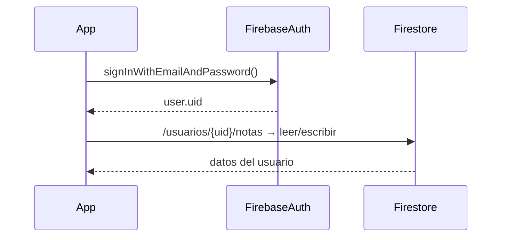

# 🔐 Firebase Authentication

Hasta ahora guardamos datos en Firestore sin saber quién los escribió. **Firebase Auth** le da a tu app la capacidad de identificar usuarios: cada persona tiene su propia cuenta y puede iniciar sesión de forma segura.

---

## ¿Por qué necesitamos autenticación?

Imagina una app de notas. Sin autenticación, cualquiera podría leer o borrar las notas de todos. Con Firebase Auth, cada nota pertenece a un usuario específico y solo él puede verla o modificarla.

```
Sin Auth: todos ven todo
Con Auth: cada usuario ve solo SUS datos
```

---

## Configuración

### 1. Activar en la consola de Firebase

1. Ve a tu proyecto en [console.firebase.google.com](https://console.firebase.google.com).
2. Menú izquierdo → **Build → Authentication**.
3. Pestaña **Sign-in method** → habilita **Email/Password**.

### 2. Agregar la dependencia

En `build.gradle.kts` (módulo app):

```kotlin
dependencies {
    implementation("com.google.firebase:firebase-auth-ktx")
}
```

> [!TIP]
> Si ya tienes el BOM de Firebase en tu proyecto (`firebase-bom`), no necesitas especificar versión aquí.

### 3. Obtener la instancia de Auth

```kotlin
import com.google.firebase.auth.FirebaseAuth

val auth = FirebaseAuth.getInstance()
```

---

## Registrar un usuario nuevo

```kotlin
fun registrar(email: String, password: String) {
    auth.createUserWithEmailAndPassword(email, password)
        .addOnSuccessListener { result ->
            val usuario = result.user
            println("Usuario creado: ${usuario?.email}")
        }
        .addOnFailureListener { error ->
            println("Error al registrar: ${error.message}")
        }
}
```

> [!IMPORTANT]
> La contraseña debe tener **mínimo 6 caracteres**, de lo contrario Firebase lanzará un error.

---

## Iniciar sesión

```kotlin
fun iniciarSesion(email: String, password: String) {
    auth.signInWithEmailAndPassword(email, password)
        .addOnSuccessListener { result ->
            val usuario = result.user
            println("Bienvenido: ${usuario?.email}")
        }
        .addOnFailureListener { error ->
            println("Credenciales incorrectas: ${error.message}")
        }
}
```

---

## Cerrar sesión

```kotlin
fun cerrarSesion() {
    auth.signOut()
}
```

---

## Obtener el usuario actual

```kotlin
val usuarioActual = auth.currentUser

if (usuarioActual != null) {
    println("Sesión activa: ${usuarioActual.email}")
    println("UID: ${usuarioActual.uid}")
} else {
    println("No hay sesión activa")
}
```

El `uid` es el identificador único del usuario. Es el que usaremos para guardar sus datos en Firestore de forma separada.

---

## Integración completa con ViewModel y Compose

### ViewModel

```kotlin
import androidx.lifecycle.ViewModel
import com.google.firebase.auth.FirebaseAuth
import kotlinx.coroutines.flow.MutableStateFlow
import kotlinx.coroutines.flow.asStateFlow

class AuthViewModel : ViewModel() {

    private val auth = FirebaseAuth.getInstance()

    private val _uiState = MutableStateFlow<AuthState>(AuthState.Idle)
    val uiState = _uiState.asStateFlow()

    fun registrar(email: String, password: String) {
        _uiState.value = AuthState.Cargando
        auth.createUserWithEmailAndPassword(email, password)
            .addOnSuccessListener { _uiState.value = AuthState.Exito }
            .addOnFailureListener { _uiState.value = AuthState.Error(it.message ?: "Error desconocido") }
    }

    fun iniciarSesion(email: String, password: String) {
        _uiState.value = AuthState.Cargando
        auth.signInWithEmailAndPassword(email, password)
            .addOnSuccessListener { _uiState.value = AuthState.Exito }
            .addOnFailureListener { _uiState.value = AuthState.Error(it.message ?: "Error desconocido") }
    }

    fun cerrarSesion() {
        auth.signOut()
        _uiState.value = AuthState.Idle
    }

    fun hayUsuarioActivo(): Boolean = auth.currentUser != null
}

sealed class AuthState {
    object Idle : AuthState()
    object Cargando : AuthState()
    object Exito : AuthState()
    data class Error(val mensaje: String) : AuthState()
}
```

### Pantalla de Login

```kotlin
@Composable
fun LoginScreen(
    viewModel: AuthViewModel = viewModel(),
    onLoginExitoso: () -> Unit
) {
    val uiState by viewModel.uiState.collectAsState()

    var email by remember { mutableStateOf("") }
    var password by remember { mutableStateOf("") }

    LaunchedEffect(uiState) {
        if (uiState is AuthState.Exito) onLoginExitoso()
    }

    Column(
        modifier = Modifier
            .fillMaxSize()
            .padding(24.dp),
        verticalArrangement = Arrangement.Center,
        horizontalAlignment = Alignment.CenterHorizontally
    ) {
        Text("Iniciar Sesión", style = MaterialTheme.typography.headlineMedium)

        Spacer(Modifier.height(24.dp))

        OutlinedTextField(
            value = email,
            onValueChange = { email = it },
            label = { Text("Correo electrónico") },
            modifier = Modifier.fillMaxWidth()
        )

        Spacer(Modifier.height(12.dp))

        OutlinedTextField(
            value = password,
            onValueChange = { password = it },
            label = { Text("Contraseña") },
            visualTransformation = PasswordVisualTransformation(),
            modifier = Modifier.fillMaxWidth()
        )

        Spacer(Modifier.height(24.dp))

        if (uiState is AuthState.Cargando) {
            CircularProgressIndicator()
        } else {
            Button(
                onClick = { viewModel.iniciarSesion(email, password) },
                modifier = Modifier.fillMaxWidth()
            ) {
                Text("Entrar")
            }
        }

        if (uiState is AuthState.Error) {
            Spacer(Modifier.height(12.dp))
            Text(
                text = (uiState as AuthState.Error).mensaje,
                color = MaterialTheme.colorScheme.error
            )
        }
    }
}
```

---

## Proteger datos en Firestore por usuario

Una vez que el usuario está logueado, usa su `uid` como parte de la ruta en Firestore para que cada quien solo acceda a lo suyo:

```kotlin
val uid = auth.currentUser?.uid ?: return

// En vez de: db.collection("notas")
// Usa:
db.collection("usuarios")
    .document(uid)
    .collection("notas")
    .add(nota)
```

---

## Flujo completo de la app



---

## Referencia rápida

| Acción | Método |
| :--- | :--- |
| Registrar usuario | `auth.createUserWithEmailAndPassword(email, pass)` |
| Iniciar sesión | `auth.signInWithEmailAndPassword(email, pass)` |
| Cerrar sesión | `auth.signOut()` |
| Usuario actual | `auth.currentUser` |
| UID del usuario | `auth.currentUser?.uid` |
| Email del usuario | `auth.currentUser?.email` |

---

_Siguiente: [Jetpack DataStore →](6-jetpack-datastore.md)_
