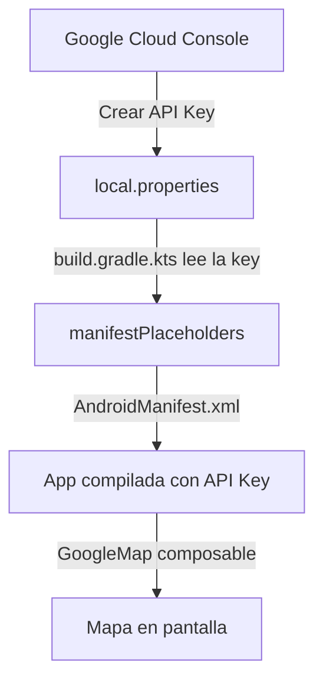

# 🗺️ Configuración de Google Maps en Android

Antes de mostrar mapas en tu app, necesitas configurar dos cosas: obtener una **clave de API** de Google y agregar las dependencias correctas. Este paso se hace una sola vez por proyecto.

---

## ¿Por qué Google Maps?

Imagina que estás construyendo una app de delivery. El usuario necesita ver dónde está el repartidor en tiempo real, o elegir su dirección en un mapa. Para eso usamos **Google Maps SDK for Android**, integrado directamente en Compose con la librería `maps-compose`.

```
Tu App (Compose) → maps-compose → Google Maps SDK → Google Cloud (tiles + datos)
```

---

## Paso 1: Obtener una API Key

Google Maps no es gratuito para uso ilimitado — necesitas identificarte con una clave de API.

1. Ve a [console.cloud.google.com](https://console.cloud.google.com).
2. Crea un proyecto (o usa uno existente).
3. Busca y habilita la API: **Maps SDK for Android**.
4. En el menú lateral → **APIs y servicios → Credenciales → Crear credencial → Clave de API**.
5. Copia la clave generada (algo como `AIzaSyA...`).

> [!IMPORTANT]
> La API Key es como una contraseña para acceder al servicio. **Nunca la subas a Git directamente**. Usa `local.properties` para guardarla de forma segura.

---

## Paso 2: Guardar la API Key de forma segura

Abre el archivo `local.properties` (en la raíz del proyecto, ya está en `.gitignore`):

```properties
# local.properties
MAPS_API_KEY=AIzaSyA_TU_CLAVE_AQUI
```

Luego expónla en `build.gradle.kts` (módulo app):

```kotlin
import java.util.Properties

val localProps = Properties().apply {
    load(rootProject.file("local.properties").inputStream())
}

android {
    defaultConfig {
        manifestPlaceholders["MAPS_API_KEY"] = localProps["MAPS_API_KEY"] ?: ""
    }
}
```

---

## Paso 3: Agregar dependencias

En `build.gradle.kts` (módulo app):

```kotlin
dependencies {
    // Google Maps SDK
    implementation("com.google.android.gms:play-services-maps:19.0.0")

    // Maps Compose (wrapper oficial para Jetpack Compose)
    implementation("com.google.maps.android:maps-compose:6.1.0")
}
```

> [!TIP]
> `maps-compose` es la librería que nos permite usar `GoogleMap` como un `@Composable`. Sin ella tendríamos que usar vistas XML dentro de Compose — mucho más complicado.

---

## Paso 4: Registrar la API Key en AndroidManifest.xml

Abre `AndroidManifest.xml` y agrega el `<meta-data>` dentro de `<application>`:

```xml
<manifest>

    <application
        android:label="@string/app_name"
        ...>

        <!-- API Key de Google Maps -->
        <meta-data
            android:name="com.google.android.geo.API_KEY"
            android:value="${MAPS_API_KEY}" />

        <activity android:name=".MainActivity" ... />

    </application>

</manifest>
```

El `${MAPS_API_KEY}` es reemplazado automáticamente en tiempo de compilación con el valor de `local.properties`.

---

## Verificación rápida

Con la configuración lista, un composable mínimo debería mostrar el mapa sin errores:

```kotlin
import com.google.maps.android.compose.GoogleMap
import com.google.maps.android.compose.rememberCameraPositionState

@Composable
fun MapaDemo() {
    val cameraState = rememberCameraPositionState()

    GoogleMap(
        modifier = Modifier.fillMaxSize(),
        cameraPositionState = cameraState
    )
}
```

Si el mapa aparece en el emulador/dispositivo, la configuración es correcta. Si ves un mapa gris o el error `OVER_QUERY_LIMIT`, revisa que la API Key esté bien ingresada y que la API esté habilitada en Google Cloud.

---

## Resumen del flujo de configuración



---

## Referencia rápida

| Paso | Qué hacer |
| :--- | :--- |
| 1 | Habilitar **Maps SDK for Android** en Google Cloud |
| 2 | Crear y copiar la API Key |
| 3 | Guardar la key en `local.properties` |
| 4 | Exponer la key en `build.gradle.kts` con `manifestPlaceholders` |
| 5 | Registrar `<meta-data>` en `AndroidManifest.xml` |
| 6 | Agregar dependencias `play-services-maps` y `maps-compose` |

---

_Siguiente: [Mapa y Marcadores →](2-mapa-y-marcadores.md)_
