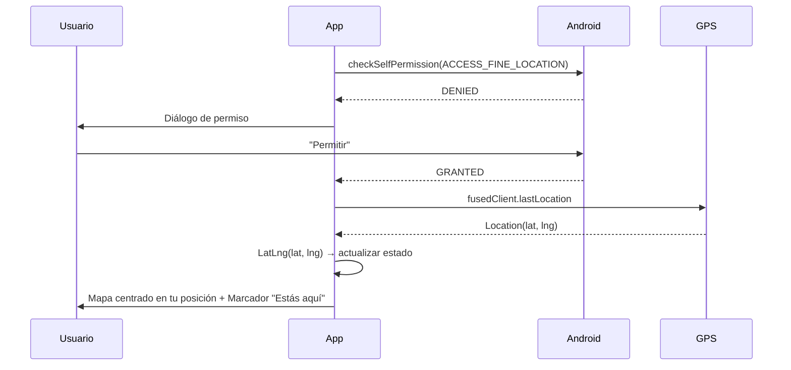

# 📡 Geolocalización: Obtener la Ubicación del Usuario

Mostrar un mapa estático es útil, pero la magia ocurre cuando el mapa sabe **dónde estás tú**. En este archivo aprenderás a pedir permiso de ubicación y a obtener las coordenadas del dispositivo en tiempo real.

---

## ¿Qué es la geolocalización?

El GPS del teléfono puede decirte exactamente dónde estás en el planeta, con coordenadas de latitud y longitud. Android gestiona esto a través de **FusedLocationProviderClient**, que combina GPS, Wi-Fi y redes móviles para darte la ubicación más precisa y eficiente.

```
GPS + Wi-Fi + Red Móvil
       ↓
FusedLocationProviderClient
       ↓
Tu App (latitud, longitud)
```

> [!NOTE]
> "Fused" (fusionado) significa que Android elige automáticamente la fuente de ubicación más precisa y menos costosa en batería según el contexto.

---

## Permisos de ubicación en Android

Android tiene dos niveles de permiso para la ubicación:

| Permiso | Precisión | Uso típico |
| :--- | :--- | :--- |
| `ACCESS_COARSE_LOCATION` | ~100 metros (red/Wi-Fi) | Clima, noticias locales |
| `ACCESS_FINE_LOCATION` | ~10 metros (GPS) | Navegación, delivery, mapas |

Ambos deben declararse en `AndroidManifest.xml` **y** pedirse al usuario en tiempo de ejecución.

### Declarar en AndroidManifest.xml

```xml
<manifest>

    <uses-permission android:name="android.permission.ACCESS_FINE_LOCATION" />
    <uses-permission android:name="android.permission.ACCESS_COARSE_LOCATION" />

    <application ... >
        ...
    </application>

</manifest>
```

---

## Paso 1: Agregar la dependencia de Location

```kotlin
// build.gradle.kts (módulo app)
dependencies {
    implementation("com.google.android.gms:play-services-location:21.3.0")
}
```

---

## Paso 2: Pedir permisos en tiempo de ejecución con Compose

Android requiere que el usuario **apruebe explícitamente** el acceso a su ubicación. En Compose usamos `rememberLauncherForActivityResult`:

```kotlin
import android.Manifest
import android.content.pm.PackageManager
import androidx.activity.compose.rememberLauncherForActivityResult
import androidx.activity.result.contract.ActivityResultContracts
import androidx.compose.runtime.*
import androidx.core.content.ContextCompat

@Composable
fun PantallaConUbicacion() {
    val contexto = LocalContext.current
    var permisoOtorgado by remember {
        mutableStateOf(
            ContextCompat.checkSelfPermission(
                contexto, Manifest.permission.ACCESS_FINE_LOCATION
            ) == PackageManager.PERMISSION_GRANTED
        )
    }

    val lanzadorPermiso = rememberLauncherForActivityResult(
        contract = ActivityResultContracts.RequestPermission()
    ) { aprobado ->
        permisoOtorgado = aprobado
    }

    LaunchedEffect(Unit) {
        if (!permisoOtorgado) {
            lanzadorPermiso.launch(Manifest.permission.ACCESS_FINE_LOCATION)
        }
    }

    if (permisoOtorgado) {
        Text("Permiso concedido ✓")
        // Aquí mostrarás el mapa con la ubicación real
    } else {
        Text("Se necesita acceso a la ubicación para usar el mapa.")
    }
}
```

### ¿Qué hace cada parte?

- **`checkSelfPermission`** — verifica si el permiso ya fue concedido antes.
- **`rememberLauncherForActivityResult`** — prepara el diálogo de permiso del sistema.
- **`LaunchedEffect(Unit)`** — ejecuta el pedido de permiso una sola vez cuando el composable aparece.
- **`aprobado`** — el resultado que el usuario eligió (true/false).

---

## Paso 3: Obtener la ubicación actual

Con el permiso concedido, usas `FusedLocationProviderClient` para obtener las coordenadas:

```kotlin
import com.google.android.gms.location.LocationServices
import com.google.android.gms.maps.model.LatLng

@Composable
fun ObtenerUbicacion() {
    val contexto = LocalContext.current
    var miUbicacion by remember { mutableStateOf<LatLng?>(null) }

    val fusedClient = remember {
        LocationServices.getFusedLocationProviderClient(contexto)
    }

    LaunchedEffect(Unit) {
        fusedClient.lastLocation.addOnSuccessListener { location ->
            if (location != null) {
                miUbicacion = LatLng(location.latitude, location.longitude)
            }
        }
    }

    miUbicacion?.let {
        Text("Estás en: lat=${it.latitude}, lng=${it.longitude}")
    } ?: Text("Obteniendo ubicación...")
}
```

> [!IMPORTANT]
> `lastLocation` puede retornar `null` si el dispositivo nunca ha usado el GPS recientemente (emulador sin ubicación simulada, por ejemplo). En ese caso debes pedir una actualización activa con `requestLocationUpdates`.

---

## Paso 4: Mostrar la ubicación en el mapa

Ahora combinamos todo: permisos + ubicación + mapa.

```kotlin
@Composable
fun MapaConMiUbicacion() {
    val contexto = LocalContext.current
    var permisoOtorgado by remember {
        mutableStateOf(
            ContextCompat.checkSelfPermission(
                contexto, Manifest.permission.ACCESS_FINE_LOCATION
            ) == PackageManager.PERMISSION_GRANTED
        )
    }
    var miUbicacion by remember { mutableStateOf<LatLng?>(null) }

    val lanzadorPermiso = rememberLauncherForActivityResult(
        ActivityResultContracts.RequestPermission()
    ) { aprobado -> permisoOtorgado = aprobado }

    LaunchedEffect(Unit) {
        if (!permisoOtorgado) lanzadorPermiso.launch(Manifest.permission.ACCESS_FINE_LOCATION)
    }

    LaunchedEffect(permisoOtorgado) {
        if (permisoOtorgado) {
            LocationServices.getFusedLocationProviderClient(contexto)
                .lastLocation
                .addOnSuccessListener { location ->
                    location?.let { miUbicacion = LatLng(it.latitude, it.longitude) }
                }
        }
    }

    val camaraInicial = miUbicacion ?: LatLng(-8.1058, -79.0225)
    val cameraState = rememberCameraPositionState {
        position = CameraPosition.fromLatLngZoom(camaraInicial, 15f)
    }

    LaunchedEffect(miUbicacion) {
        miUbicacion?.let {
            cameraState.animate(CameraUpdateFactory.newLatLngZoom(it, 15f))
        }
    }

    GoogleMap(
        modifier = Modifier.fillMaxSize(),
        cameraPositionState = cameraState,
        properties = MapProperties(isMyLocationEnabled = permisoOtorgado)
    ) {
        miUbicacion?.let { ubicacion ->
            Marker(
                state = rememberMarkerState(position = ubicacion),
                title = "Estás aquí"
            )
        }
    }
}
```

---

## Integración completa con ViewModel

Para apps reales, la lógica de ubicación va en el ViewModel para separar responsabilidades.

### ViewModel

```kotlin
import android.annotation.SuppressLint
import android.content.Context
import androidx.lifecycle.ViewModel
import com.google.android.gms.location.LocationServices
import com.google.android.gms.maps.model.LatLng
import kotlinx.coroutines.flow.MutableStateFlow
import kotlinx.coroutines.flow.asStateFlow

class MapaViewModel : ViewModel() {

    private val _ubicacion = MutableStateFlow<LatLng?>(null)
    val ubicacion = _ubicacion.asStateFlow()

    @SuppressLint("MissingPermission")
    fun cargarUbicacion(context: Context) {
        LocationServices.getFusedLocationProviderClient(context)
            .lastLocation
            .addOnSuccessListener { location ->
                location?.let {
                    _ubicacion.value = LatLng(it.latitude, it.longitude)
                }
            }
    }
}
```

> [!NOTE]
> La anotación `@SuppressLint("MissingPermission")` le dice al compilador que ya verificamos el permiso antes de llamar este método. Es responsabilidad tuya no llamarlo sin el permiso concedido.

### Pantalla

```kotlin
@Composable
fun MapaScreen(viewModel: MapaViewModel = viewModel()) {
    val contexto = LocalContext.current
    val ubicacion by viewModel.ubicacion.collectAsState()

    var permisoOtorgado by remember {
        mutableStateOf(
            ContextCompat.checkSelfPermission(
                contexto, Manifest.permission.ACCESS_FINE_LOCATION
            ) == PackageManager.PERMISSION_GRANTED
        )
    }

    val lanzadorPermiso = rememberLauncherForActivityResult(
        ActivityResultContracts.RequestPermission()
    ) { aprobado ->
        permisoOtorgado = aprobado
        if (aprobado) viewModel.cargarUbicacion(contexto)
    }

    LaunchedEffect(Unit) {
        if (permisoOtorgado) viewModel.cargarUbicacion(contexto)
        else lanzadorPermiso.launch(Manifest.permission.ACCESS_FINE_LOCATION)
    }

    val camaraInicial = ubicacion ?: LatLng(-8.1058, -79.0225)
    val cameraState = rememberCameraPositionState {
        position = CameraPosition.fromLatLngZoom(camaraInicial, 15f)
    }

    LaunchedEffect(ubicacion) {
        ubicacion?.let {
            cameraState.animate(CameraUpdateFactory.newLatLngZoom(it, 15f))
        }
    }

    GoogleMap(
        modifier = Modifier.fillMaxSize(),
        cameraPositionState = cameraState,
        properties = MapProperties(isMyLocationEnabled = permisoOtorgado)
    ) {
        ubicacion?.let { pos ->
            Marker(
                state = rememberMarkerState(position = pos),
                title = "Mi ubicación"
            )
        }
    }
}
```

---

## Flujo completo



---

## Simulando ubicación en el emulador

Si estás probando en un emulador (sin GPS real):

1. En Android Studio: **Emulator → More (⋮) → Location**.
2. Ingresa latitud y longitud manualmente (ej. `-8.1058, -79.0225` para Trujillo).
3. Haz clic en **Set Location**.
4. Ahora `lastLocation` retornará esa coordenada.

---

## Referencia rápida

| Tarea | Código |
| :--- | :--- |
| Verificar permiso | `ContextCompat.checkSelfPermission(ctx, Manifest.permission.ACCESS_FINE_LOCATION)` |
| Pedir permiso en Compose | `rememberLauncherForActivityResult(ActivityResultContracts.RequestPermission())` |
| Obtener cliente de ubicación | `LocationServices.getFusedLocationProviderClient(context)` |
| Última ubicación conocida | `fusedClient.lastLocation.addOnSuccessListener { location -> }` |
| Activar capa "Mi ubicación" | `MapProperties(isMyLocationEnabled = true)` |
| Anotar permiso implícito | `@SuppressLint("MissingPermission")` |

---

_Siguiente: [Ejercicios →](4-ejercicios.md)_
